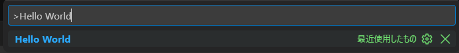
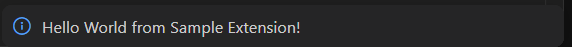

## デバッグ手順

環境構築が完了したら、以下の手順で実際に拡張機能を動かします。

まずは、先ほど作成されたディレクトリ（sample-extension）をVSCodeで開きます。


### 1. ビルド

以下のコマンドで、ビルドを行います。
```sh
pnpm watch
# watchモードが動いている間、コード変更の際に自動でビルドが走ります（ホットリロード）
```

> **`2. デバッグ起動`** では、ビルドも兼ねて行われます

### 2. デバッグ起動
`F5`キーを押します（または「実行とデバッグ」から「Run Extension」をクリック）

デバッグが起動すると、ウィンドウが新しく開かれるのでそちらでデバッグします。

#### デバッグ
まず、`Ctrl + Shift + P`（Macは `Cmd + Shift + P`）を押します。

`package.json`に定義されている、`contributes.commands.command`の内容を入力して実行します。



成功すると、以下の様な通知が右下に出ます。


これは、`/src/extensions.ts`にあるコードが動いていることを示しています。
```ts
import * as vscode from 'vscode';

export function activate(context: vscode.ExtensionContext) {
  console.log('Congratulations, your extension "sample-extension" is now active!');

  const disposable = vscode.commands.registerCommand('sample-extension.helloWorld', () => {
    // 以下のコードが動作し、ポップアップ通知が表示されます
    vscode.window.showInformationMessage('Hello World from Sample Extension!');
  });

  context.subscriptions.push(disposable);
}

export function deactivate() {}
```
