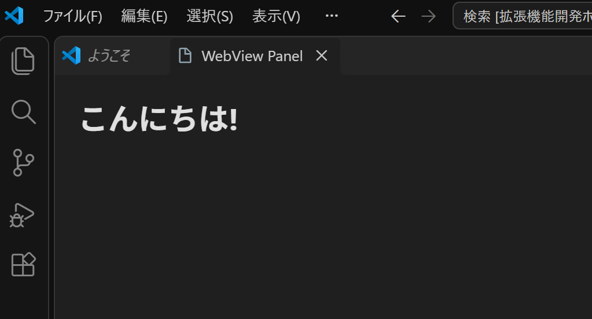
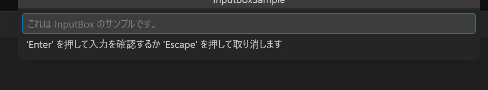

## 基本的なUI機能

UIを作るときには、`vscode.window`を使います。

`vscode.window` には、様々な機能が用意されています。

- vscode.window.showInformationMessage()
- vscode.window.createWebviewPanel()
- vscode.window.createInputBox()
...

いくつか、使い方の例を示します。

以下の例を`activate`関数の中に書いてデバッグしてみてください。

---

### ・showInformasionMessage

メッセージ表示は一番簡単なUI表示です。

使い方は`console.log`と同じようなイメージです。

```ts
vscode.window.showInformationMessage('Hello World!');
```


---

### ・createWebviewPanel

`create`系の機能は、変数を使って使用します。

例えば、以下の例では`webView`というオブジェクトを作って、それを使用します。

```ts
const webView = vscode.window.createWebviewPanel(
    "WebViewSample", // 識別名
    "WebView Panel", // 表示名
    vscode.ViewColumn.One // 表示場所
);

webView.webview.html = `
    <html lang="ja">
        <head>
            <meta charset="UTF-8" />
            <title>Test</title>
        </head>
        <body>
            <h1>こんにちは!</h1>
        </body>
    </html>
`;
```



---

### ・createInputBox

InputBoxは、対話型の機能を作る際に重要です。

`inputBox`オブジェクトを作って、プレースホルダーとタイトルを設定してみます。

```ts
const inputBox = vscode.window.createInputBox();

inputBox.placeholder = 'これは InputBox のサンプルです。';
inputBox.title = 'InputBoxSample';
```

しかし、これだけでは動きません。

動かすためには、「値変更時」と「決定時」のイベントを登録する必要があります。

以下、一例です。

```ts
inputBox.onDidChangeValue(text => {
    if (text.length < 3) {
        inputBox.validationMessage = '3文字以内で入力してください。';
    } else {
        inputBox.validationMessage = undefined;
    }
});

inputBox.onDidAccept(() => {
    const value = inputBox.value;
    vscode.window.showInformationMessage(`入力値: ${value}`);
    inputBox.hide();
});
```

プレースホルダー・タイトル・イベント定義ができたので、あとは表示するだけです。

```ts
inputBox.show();
```



---

この他にもいろいろなUIが用意されているので、試してみてください。
